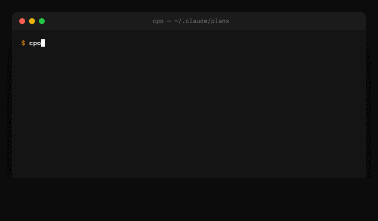

# Claude Plans Organizer 📋

Make your Claude Code plan files human-readable, browsable, and searchable.

[](https://bun.sh)
[](https://www.typescriptlang.org)
[](#license)
[](#requirements)

**Website:** [jhubbardsf.github.io/claude-plans-organizer](https://jhubbardsf.github.io/claude-plans-organizer/)

<p align="center">
  
</p>

## The Problem

Claude Code's plan mode saves every plan to `~/.claude/plans` with a machine-generated name:

```
1733956987164-bdb8f1b2db294f8ab1a7dd34d7d1b33f.md
```

That is a 13-digit Unix-millisecond timestamp glued to a 32-character hex hash. After a week of planning you have a directory full of these, none of which you can read, recognize, or grep for.

## The Solution

`cpo` scans `~/.claude/plans`, sends each plan to the Claude CLI, and gets back a human-readable **title**, **description**, and **tags**. That metadata is cached and keyed by file checksum, so a plan is only ever analyzed once. The result is an interactive browser plus a handful of commands to list, view, copy, export, and refresh your plans.

```
? Select a plan: (Use arrow keys)
❯  1. JWT Authentication Implementation · today · 8.2K
   2. Postgres Schema Migration · today · 12.1K
   3. React Server Components Refactor · 2d ago · 6.5K
```

## Installation

There is no Homebrew tap. `cpo` runs on [Bun](https://bun.sh).

### Install globally (recommended)

```bash
git clone https://github.com/jhubbardsf/claude-plans-organizer.git
cd claude-plans-organizer
bun install
bun link        # makes the `cpo` command available everywhere
```

Then run `cpo` from any directory.

### Run locally

```bash
git clone https://github.com/jhubbardsf/claude-plans-organizer.git
cd claude-plans-organizer
bun install
bun run src/index.ts
```

## Requirements

- **Bun** v1.3 or later
- **macOS** or **Linux**
- **zsh**, available on your `PATH`
- **Claude CLI**, authenticated, and reachable through a shell alias named **`claude-h`**

The analyzer literally runs `zsh -ic 'claude-h -p "$(cat <tempfile>)"'`, so the `claude-h` alias has to exist in an interactive zsh shell. Add it to your `~/.zshrc`:

```bash
alias claude-h='claude --model haiku'
```

Haiku is recommended because the analysis prompts are short and cheap, but any authenticated Claude CLI invocation that accepts `-p` and prints text works. Verify it before running `cpo`:

```bash
claude-h -p "hi"
```

## Usage

### Browse (default)

Run `cpo` with no arguments to launch the interactive browser.

```bash
cpo
# or
cpo browse
```

On a **cold start** with an empty cache, `cpo` scans the directory and analyzes every plan in parallel:

```
  Claude Plans Organizer
  Browse your Claude Code plans with human-readable names

✔ Found 14 plan files

Analyzing 14 new/changed files with Claude (10 parallel)...

  [1/14] 1733956987164-bdb8f1b2db294f… ✓ JWT Authentication Implementation
  [2/14] 1733951220933-a1c9f0e2bb7d41… ✓ Postgres Schema Migration
  [3/14] 1733889104551-77de0b9c12fa48… ✓ React Server Components Refactor
  ...
  [14/14] 1733120771010-09bb3c1aa5e240… ✓ CLI Output Formatting Pass

✓ Loaded 14 plans

? Select a plan: (Use arrow keys)
❯  1. JWT Authentication Implementation · today · 8.2K
   2. Postgres Schema Migration · today · 12.1K
   3. React Server Components Refactor · 2d ago · 6.5K
   (Exit)
```

On a **warm run**, every checksum is already cached, so the whole "Analyzing…" block is skipped and the list loads instantly. You only pay the analysis cost once per file.

Selecting a plan shows its detail block and an action menu:

```
JWT Authentication Implementation
────────────────────────────────────────────────────────────
Description: Adds JWT-based auth to the Express API with refresh tokens and session management.
Tags:        #feature #auth #api
Project:     unknown
Modified:    12/14/2025, 9:31:02 AM
Size:        8.2K
File:        1733956987164-bdb8f1b2db294f8ab1a7dd34d7d1b33f.md

? What would you like to do?
❯ View full content
  Copy to clipboard
  Export to file
  Open in editor
  ← Back to list
```

### List

`cpo list` (alias `cpo ls`) prints a compact, two-line-per-plan list.

```bash
cpo list
cpo list --sort name
cpo list --sort size --reverse
cpo list --limit 10
cpo list --tag feature
cpo list --json
```

Output:

```
 1. JWT Authentication Implementation · today #feature #auth #api
    Adds JWT-based auth to the Express API with refresh tokens and session ma…

 2. Postgres Schema Migration · today #database #migration
    Introduces a versioned migration runner and seeds the initial schema.

ℹ 14 plans in /Users/josh/.claude/plans
```

### View

`cpo view` (alias `cpo show`) prints a plan's full content. It accepts a filename or a partial name/title match.

```bash
cpo view 1733956987164-bdb8f1b2db294f8ab1a7dd34d7d1b33f.md
cpo view jwt-auth        # partial match, finds the first hit
cpo show "JWT Auth"      # title match
```

### Copy

`cpo copy` (alias `cpo cp`) copies a plan's content to the system clipboard.

```bash
cpo copy jwt-auth
cpo cp jwt-auth
```

### Export

`cpo export` (alias `cpo save`) writes a plan to a file. Without a destination it writes `./<filename>` in the current directory.

```bash
cpo export jwt-auth                    # writes ./<original-filename> (already ends in .md)
cpo export jwt-auth ./my-plan.md       # custom path
cpo save jwt-auth ./exports/plan.md
```

### Refresh

`cpo refresh` forces re-analysis, useful when an analysis failed or you want fresh titles. With no arguments it refreshes everything; `--all` does the same explicitly. Pass a plan name to refresh a single file.

```bash
cpo refresh             # re-analyze all plans
cpo refresh --all       # same thing, explicit
cpo refresh jwt-auth.md # re-analyze one plan
```

### Stats

`cpo stats` shows cache and directory information.

```bash
cpo stats
```

```
  Claude Plans Organizer Statistics
  ─ ─ ─ ─ ─ ─ ─ …

  Plans Directory:  /Users/josh/.claude/plans
  Cache File:       /Users/josh/.cache/claude-plans-organizer/metadata.json

  Total Plans:      14
  Cached Plans:     14
  Pending Analysis: 0

  Last Updated:     12/14/2025, 9:31:02 AM
```

### Projects

`cpo projects` resolves which project directory each plan was created in by scanning `~/.claude/sessions`. This is slow on the first run because there are usually many session files, but the result is cached afterward.

```bash
cpo projects
```

## Commands Reference

| Command | Aliases | Description |
|---------|---------|-------------|
| `cpo` | `cpo browse` | Interactive plan browser (default) |
| `cpo list` | `cpo ls` | Compact list of all plans |
| `cpo view <plan>` | `cpo show` | Print a plan's full content |
| `cpo copy <plan>` | `cpo cp` | Copy a plan to the clipboard |
| `cpo export <plan> [destination]` | `cpo save` | Write a plan to a file |
| `cpo refresh [plan]` | | Force re-analyze plans |
| `cpo stats` | | Show cache statistics |
| `cpo projects` | | Resolve project directories (slow) |

## Command Options

**Global (browse and list):**

```
-c, --concurrency <n>   Max parallel Claude CLI calls during analysis (default: 10)
```

**`cpo list`:**

```
-s, --sort <date|name|size>   Sort key (default: date)
-r, --reverse                 Reverse sort order
-n, --limit <n>               Limit number of results
-t, --tag <tag>               Filter by tag (e.g. feature, auth, database)
-j, --json                    Output as JSON
-c, --concurrency <n>         Max parallel Claude CLI calls (default: 10)
```

**`cpo refresh`:**

```
-a, --all   Refresh all plans
```

## How It Works

### First run vs. cached run

On the **first run**, `cpo` scans `~/.claude/plans` for `*.md` files and computes a checksum for each one. Any file whose checksum is not already in the cache gets its content (truncated to roughly 4000 characters) sent to Claude via `claude-h -p`, which returns JSON of the form `{ title, description, tags }`. Analyses run in parallel, 10 workers by default, tunable with `--concurrency`.

On **later runs**, checksums that already match a cache entry are loaded instantly, so unchanged plans are never re-analyzed. Files that have been deleted from the plans directory are pruned from the cache.

### Caching

Metadata is stored in `~/.cache/claude-plans-organizer/metadata.json`, keyed by checksum. Editing a plan changes its checksum and triggers re-analysis automatically. To force a full rebuild, run `cpo refresh --all`.

### Graceful fallback

If analysis fails for a file, `cpo` does not abort. It derives a title from the filename, tags the plan `uncategorized`, and marks it with a yellow `⚠` during analysis. The browser stays usable and you can re-run `cpo refresh` on those entries later.

### Parallelism

The default concurrency of 10 keeps the first run fast without overwhelming the Claude CLI. Lower it on constrained machines or if you hit rate limits (`cpo browse -c 5`), raise it on a fast connection (`cpo list -c 15`).

## Configuration

Defaults live in `src/types/index.ts` (`DEFAULT_CONFIG`):

| Setting | Default |
|---------|---------|
| `plansDirectory` | `~/.claude/plans` |
| `cacheDirectory` | `~/.cache/claude-plans-organizer` |
| `maxContentLength` | `4000` (chars of plan content sent to Claude) |
| `analysisDelayMs` | `300` (delay between calls, eases rate limiting) |
| `concurrency` | `10` (max parallel Claude CLI calls) |

### Environment variables

| Variable | Effect |
|----------|--------|
| `HOME` | Determines the plans and cache directory locations |
| `EDITOR` | Editor launched by the "Open in editor" action (defaults to `vim`) |

## Scripting with JSON

`cpo list --json` emits structured data you can pipe into `jq`:

```bash
# All plans tagged "feature"
cpo list --json | jq '.[] | select(.tags | index("feature"))'

# Count plans by tag
cpo list --json | jq '[.[] | .tags[]] | group_by(.) | map({tag: .[0], count: length})'

# Export the five most recent plans
for plan in $(cpo list --limit 5 --json | jq -r '.[].filename'); do
  cpo export "$plan" "./exports/$plan"
done
```

## Troubleshooting

### "No plans found"

Check that `~/.claude/plans` exists and contains `.md` files. If it is empty, run Claude Code in plan mode to generate some plans first.

### "Claude CLI failed" / everything comes back `uncategorized`

The `claude-h` alias is the usual culprit. Confirm each of these:

```bash
claude-h -p "hi"          # must print text and exit 0
```

- The alias is defined in `~/.zshrc` (the analyzer uses an interactive zsh: `zsh -ic`).
- The Claude CLI is authenticated.
- `zsh` is on your `PATH`.

### First run is slow

The cold start makes one Claude call per plan. That is a one-time cost: subsequent runs load from cache and skip analysis entirely. Lower `--concurrency` if you are being rate-limited, raise it to speed the first run up.

### Stale or wrong titles

```bash
cpo refresh --all     # clear and re-analyze everything
cpo refresh plan.md   # re-analyze a single plan
```

### TypeScript errors

```bash
bun run typecheck
```

## Development

Architecture, the service layer, the type system, and guidance for adding commands or services are documented in [AGENTS.md](./AGENTS.md) (imported by [CLAUDE.md](./CLAUDE.md)). In short: commands sit on top of a `PlanService` orchestrator that composes a scanner, an analyzer, and a checksum-keyed cache.

## Roadmap

Not yet built, but on the list:

- Full-text search across plan content (not just titles and tags)
- Bulk export
- Watch mode (auto-refresh on file changes)
- Archive and delete
- Plan diff and comparison

## License

MIT

## Author

Built with Claude Code by Josh Hubbard ([@jhubbardsf](https://github.com/jhubbardsf)).

### Pairs well with

- **[sopsx](https://github.com/jhubbardsf/sopsx)**: SOPS wrapper that auto-detects the right `AWS_PROFILE` from KMS keys
- **[aws-sso-refresh](https://github.com/jhubbardsf/aws-sso-refresh)**: keeps AWS SSO sessions refreshed before they expire
